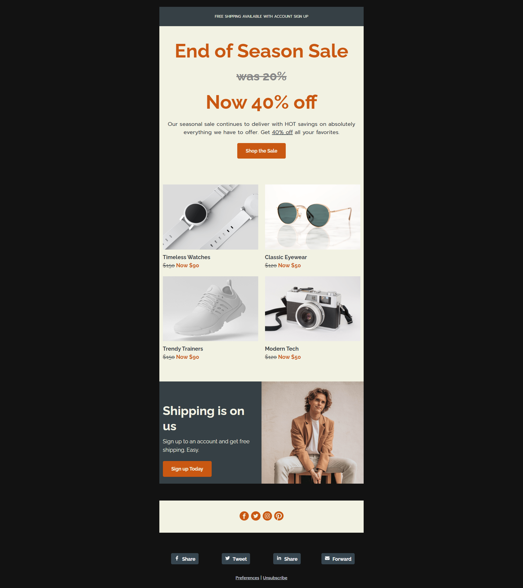

# Promotional Email

This is a solution to an email template on [Campaign Monitor](https://www.campaignmonitor.com/email-templates/). 
Campaign Monitor is a website that hosts free email templates. 

## Table of contents
- [Overview](#overview)
  - [Screenshot](#screenshot)
  - [Links](#links)
- [My process](#my-process)
  - [Built with](#built-with)
  - [What I learned](#what-i-learned)
  - [Useful resources](#useful-resources)

## Overview

### Screenshot



### Links

- [GitHub Repo URL](https://github.com/adrvnc/promotional_email)
- [Live Site URL](https://adrvnc.github.io/promotional_email/)

## My Process

### Built with 

- HTML5
- Inline CSS & Media Queries  

### What I learned 

While doing this project, my biggest dilemma was figuring out 
how to create a responsive four-column layout that would work 
across all email clients. My solution was to build it using ```div``` 
tags and ghost tables for Microsoft Outlook compatibility. 

### Useful resources

[Creating a Future-Proof Responsive Email Without Media Queries](https://webdesign.tutsplus.com/tutorials/creating-a-future-proof-responsive-email-without-media-queries--cms-23919)- This tutorial helped me understand how to create an email layout with more than two columns.
Helpful for anyone who wants to learn how to create
responsive emails from scratch. 
